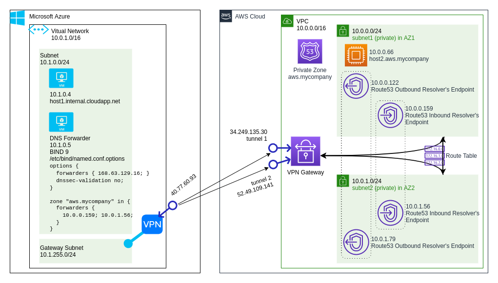

# Important!
Deploying this solution incurs costs of using both AWS and Azure services.
Please refer respective price lists for details.

THE SOFTWARE IS PROVIDED "AS IS", WITHOUT WARRANTY OF ANY KIND.

# Architecture



Flow of DNS queries when resolving from AWS


Flow of DNS queries when resolving from Azure


To get much more details on the topic, watching awesome
[Deep dive on DNS in the hybrid cloud (NET410)](https://youtu.be/_Z5jAs2gvPA)
AWS re:Invent 2019 session performed by [Gavin McCullagh](https://www.linkedin.com/in/gavin-mccullagh-1124492/).

# Deployment

1.
```
$ aws cloudformation deploy --stack-name aws-azure-hybrid-step1 --template-file step\ 1.AWS\ CloudFormation\ template.yaml --parameter-overrides KeyPairName=xxx
```

2. This step typically takes 30-40 minutes to complete.
```
$ az group create --name aws-azure-hybrid --location xxx
```

```
$ az group deployment create --resource-group aws-azure-hybrid --name step2 --template-file step\ 2.Azure\ deployment\ template.json --parameters allowSshFromIpRange='x.x.x.x/x' adminPassword=xxxxxxx awsInboundResolverIp1=x.x.x.x awsInboundResolverIp2=x.x.x.x
```

3. This step typically takes 5-10 minutes to complete.

For AzureDnsForwarderIp, use forwarder's *private* address. The forwarder has both private and public address, but public address is required only for installing BIND 9 on it.
```
$ aws cloudformation deploy --stack-name aws-azure-hybrid-step3 --template-file step\ 3.AWS\ CloudFormation\ template.yaml --parameter-overrides VPC=vpc-xxx Subnet1=subnet-xxx Subnet2=subnet-xxx AzureVpnGatewayPublicIp=x.x.x.x AzureDnsForwarderIp=x.x.x.x
```

4.
```
$ az group deployment create --resource-group aws-azure-hybrid --name step4 --template-file step\ 4.Azure\ deployment\ template.json --parameters AwsVpnGatewayPublicIp1=x.x.x.x sharedKey1=xxxxx AwsVpnGatewayPublicIp2=x.x.x.x sharedKey2=xxxxx
```

# Verifying that VPN and hybrid DNS works for both AWS and Azure networks.

## Connect the Azure VM and resolve AWS instance's name from there.

In this snippet x.x.x.x is host1's (Azure) public IP address.
```
$ ssh adminuser@x.x.x.x (host1's public IP)
```

```
adminuser@host1:~$ dig @dns-forwarder host2.aws.mycompany
[...]
;; ANSWER SECTION:
host2.aws.mycompany.    41      IN      A       10.0.0.66
[...]
;; SERVER: 10.1.0.5#53(10.1.0.5)
[...]
```

## Connect the AWS instance (over VPN) and resolve Azure VM's name from there.

1. Install the AWS instance's SSH key on Azure VM.

In this snippet x.x.x.x is host1's (Azure) public IP address.
```
$ scp ~/.ssh/id_rsa adminuser@x.x.x.x:~/.ssh/id_rsa
```
2. Connect the Azure VM.
```
$ ssh adminuser@x.x.x.x (host1's public IP)
```

3. Make a note of host1's fully qualified domain name.
```
$ ping host1
PING host1.internal.cloudapp.net
```

4. Jump to the AWS instance over VPN.
```
adminuser@host1:~$ ssh ec2-user@10.0.0.66
```

5. Resolve the Azure VM's name.
```
[ec2-user@ip-10-0-0-66 ~]$ dig host1.internal.cloudapp.net
[...]
;; ANSWER SECTION:
host1.internal.cloudapp.net. 10 IN      A       10.1.0.4
[...]
;; SERVER: 10.0.0.2#53(10.0.0.2)
[...]
```

It's interesting to note from the output above that the hybrid DNS is integrated into AWS VPC's default "plus 2" DNS server at 10.0.0.2

# TODO

## Azure VPN Gateway in active-active mode
https://docs.aws.amazon.com/vpn/latest/s2svpn/VPNConnections.html

https://cloudnetworking.io/2019/02/25/aws-to-azure-s2s-vpn-ha-active-active/

## VPN dynamic routing using BGP
https://docs.aws.amazon.com/vpn/latest/s2svpn/VPNRoutingTypes.html#vpn-static-dynamic
